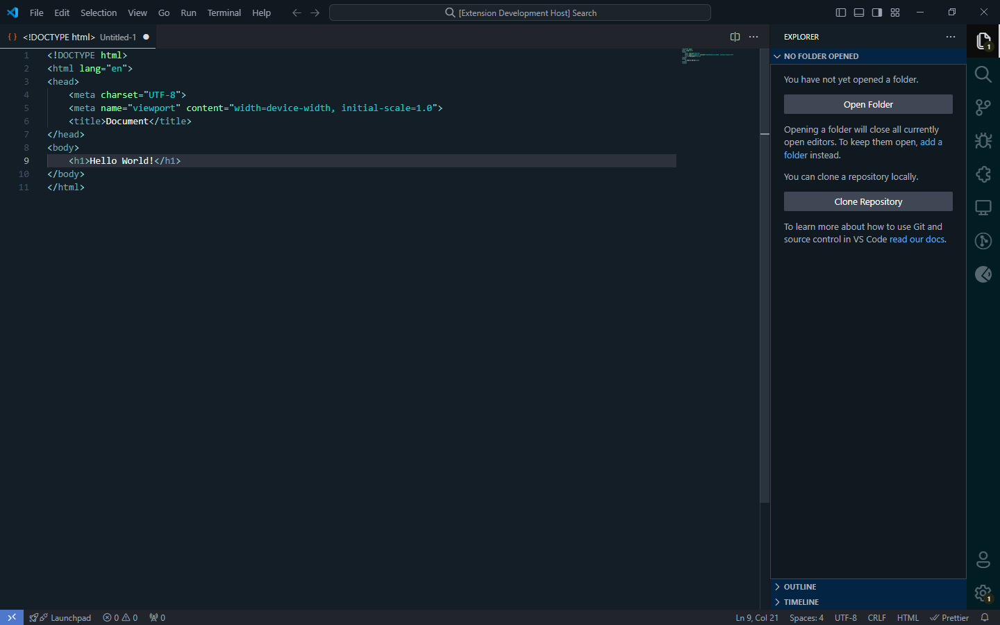
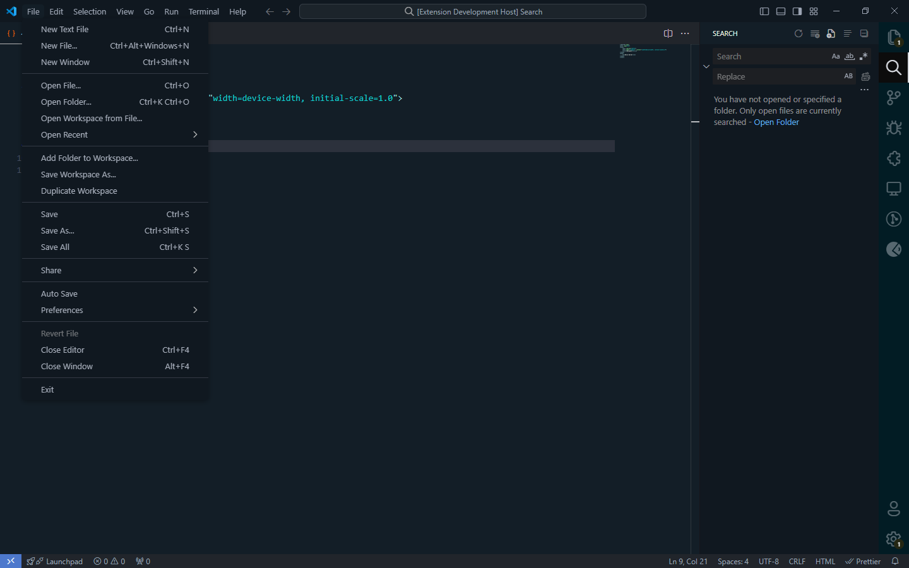
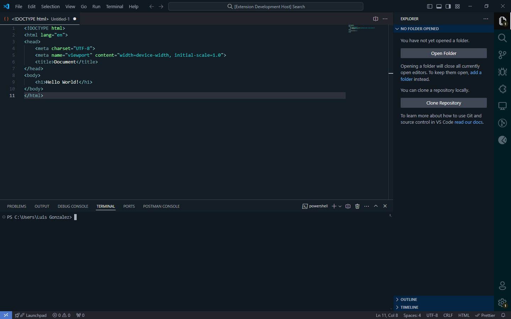

🌌 Nocturne Elegance - VS Code Dark Theme 🌌
Immerse yourself in the world of coding with Nocturne Elegance, the ultimate dark theme for Visual Studio Code. Designed to provide a serene and stylish programming experience, this theme combines deep and vibrant tones to reduce eye strain and improve your focus during long night-time coding sessions.

## Dark Code

🎨 Key Features:
Perfect Contrasts: Carefully selected colors to provide optimal contrast and minimize eye fatigue.
Sophisticated Palette: A blend of dark tones and bright accents that highlight your code with clarity and elegance.
Eye Care: Designed to reduce glare and offer a comfortable visual experience, ideal for long coding sessions.
Wide Compatibility: Fully compatible with a wide range of programming languages and VS Code extensions.
Professional Aesthetics: A modern and minimalist design that enhances the beauty of your development environment without unnecessary distractions.

✨ Boost Your Productivity
With Nocturne Elegance, every line of code becomes a work of art. Enjoy a dark interface that is not only easy on your eyes but also elevates your workspace to a new level of sophistication and efficiency.

🌟 Join the Dark Code Revolution
Download Nocturne Elegance now and transform your coding experience. Because when it comes to writing code, darkness has never looked so good.

To install this theme, follow these simple steps:

Open Visual Studio Code.
Go to the Extensions tab and search for Nocturne Elegance.
Click "Install".
Select Nocturne Elegance from the list of themes.
Enjoy your new and elegant development environment!

💖 Support and Donations
If you enjoy Nocturne Elegance and would like to support its development, please consider making a donation. Your support helps to keep the project alive and continually improves it.

https://www.paypal.me/LGonzalezduerto